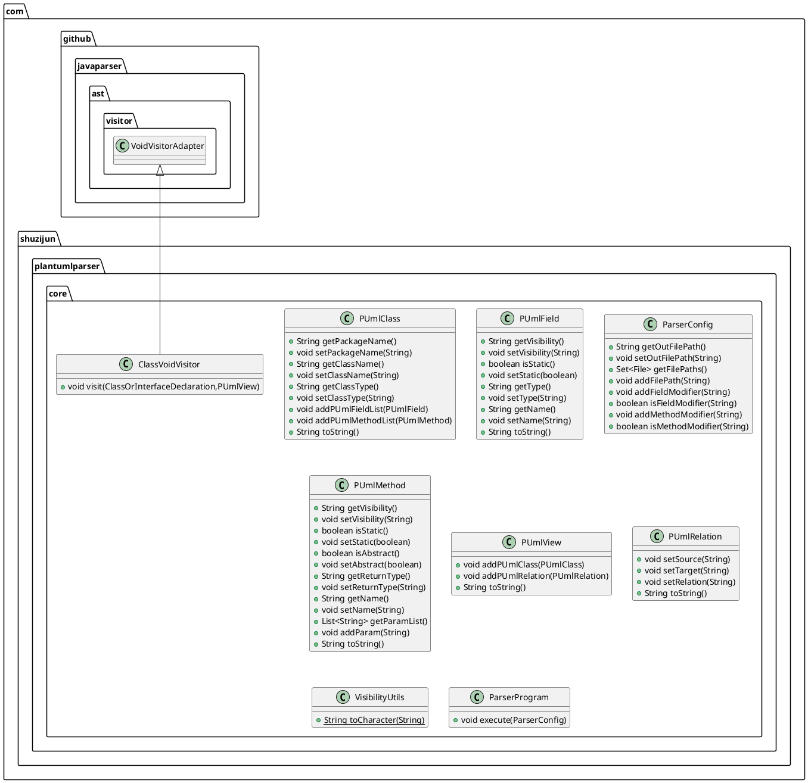

# JTPC
An experimental CLI wrapper (around the `plantuml-parser-cli`) to generate PlantUML class diagrams from Java source code. I develop this CLI in a fork of original project [shuzijun/plantuml-parser](https://github.com/shuzijun/plantuml-parser).

The main benefit is to avoid loosing so much time in updating your diagram at each step.

Note: the IntelliJ plugin build has been disabled because it currently fails and would require some changes to support the same feature as JTPC. I will not make it work to have the same feature as I consider the CLI is enough and solves my problem.

## Examples
Here a few examples of schema, so you can see the final rendering. All examples are placed under [jtpc/examples folder](jtpc/examples).

## How to setup
*I know this is not a straightforward setup but is the best I can do in the short time I invest in this mini project...*
1. Clone the repository
   ```sh
   git clone git@github.com:samuelroland/jtpc.git
   ```
1. Build the CLI with all dependencies included (using the Gradle wrapper, it will install Gradle if necessary)
   ```sh
   ./gradlew uberJar
   ```
1. Build the Docker image
   ```sh
    sudo docker build -t jtpc -f jtpc/Dockerfile .
   ```
1. Run the CLI
   Note: We mount the current folder to `/cli/code` in container, to give it access to the current folder. Therefore, the given path (first argument) needs to be 
    ```
    docker run -v .:/cli/code jtpc
    ```
1. Instead of typing `docker run -v .:/cli/code jtpc` everytime I recommend to setup an alias like this
    ```sh
    alias jtpc="docker run -v .:/cli/code jtpc"
    ```
    You can now just run 
    ```sh
    jtpc src/main diagram.puml
    ```
See more options and usage below.

## How to use the CLI
The first argument is a path to find Java source code, the second one is the output filename (generally a `.puml` or `.plantuml`)
```sh
jtpc src/main diagram.puml
```

Optionally, if you need to customize your schema, here is how you can do it.
TODO
To see all possible options of the underlying parser CLI:
```sh
jtpc parserhelp
```

## How it works
`jtpc` is just a bash script and Docker image as a convenience to easily run the `plantuml-parser-cli` developed in the original project. In addition to not needing to run `java -jar /mega/long/path/to/full/uber.jar` it enables some post operations to manually adjust the rendering.

**Changes made to the CLI and core logic**  
To fit my teacher's needs, I did a few changes to the source code which you can read in details in the recent commits, but here is a quick recap:
1. Show types after variables name: instead of `int age` it displays `age: int`

----

**See the original README below**

----

# plantuml-parser  

将Java源代码转换为plantuml  
Convert the Java source code to Plantuml

## plantuml-parser-core

```java
    public static void main(String[]args)throws IOException{
        ParserConfig parserConfig=new ParserConfig();
        parserConfig.addFilePath(filePath or fileDirectory);
        parserConfig.setOutFilePath(out file path);
        parserConfig.addMethodModifier(private or protected or default or public );
        parserConfig.addFieldModifier(private or protected or default or public );

        ParserProgram parserProgram=new ParserProgram(parserConfig);
        parserProgram.execute();
        }
```

## plantuml-parser-plugin

<p align="center">
  
</p> 

## output
### demo  

