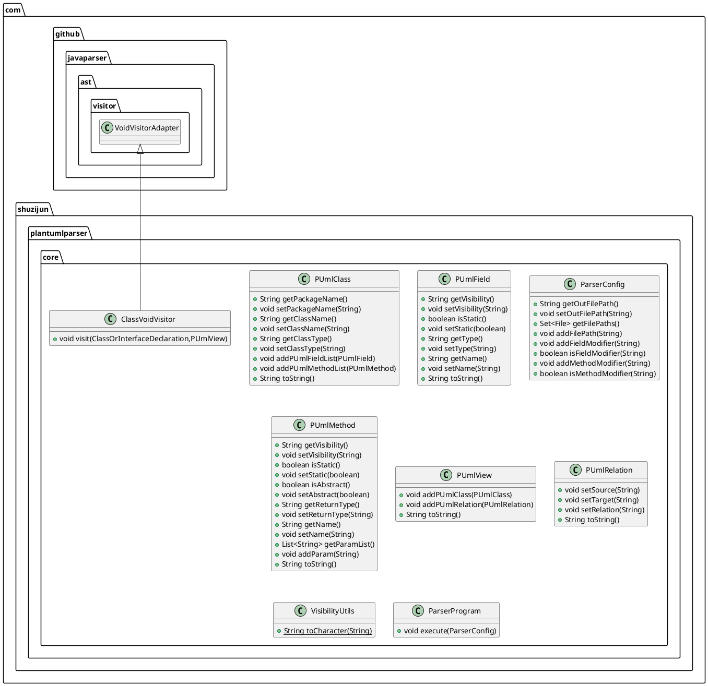

# PlantUML generator for Java

This is a fork used by `ctp`, checkout [its repos](https://github.com/samuelroland/ctp) to use this !

**Changes made to the CLI and core logic**  
To fit my teacher's needs or just making things prettier, I did a few changes to the source code which you can read in details in the recent commits, but here is a quick recap:
1. Show types after variables name: instead of `int age` it displays `age: int`
1. Add line breaks and tabs after ~70 chars, when methods definitions are too long (this avoids creating very large class rectangle)
1. Show return type of methods at the end: instead of `String toString()` it displays `toString(): String`.
1. Do not use `<<Create>>` as return type for constructors
1. Fix intern class association: instead of `+..` (dotted line) it is now `+--` (solid line)
1. 


**Bugs**
1. Fix a bug when giving an output path as just a file (without any folder path prefix)

TODO: bug interface attribute are public by default even if not specified...

*Note*: the IntelliJ plugin build has been disabled because it currently fails and would require some changes to support the same feature as ctp. I will not make it work to have the same feature as I consider the CLI is enough and solves my problem.

*Note: before the `ctp` repos refactoring, this repos was name `jtpc` (Java To PlantUML CLI) and contained the bash CLI with post-processing, but since I supported C++ and did another fork, the tool needed a refactor, a new repos and new name. Don't wonder when you find old references to jtpc in the commit history.*

----

**See the original README below**

----

# plantuml-parser  

将Java源代码转换为plantuml  
Convert the Java source code to Plantuml

## plantuml-parser-core

```java
    public static void main(String[]args)throws IOException{
        ParserConfig parserConfig=new ParserConfig();
        parserConfig.addFilePath(filePath or fileDirectory);
        parserConfig.setOutFilePath(out file path);
        parserConfig.addMethodModifier(private or protected or default or public );
        parserConfig.addFieldModifier(private or protected or default or public );

        ParserProgram parserProgram=new ParserProgram(parserConfig);
        parserProgram.execute();
        }
```

## plantuml-parser-plugin

<p align="center">
  
</p> 

## output
### demo  

